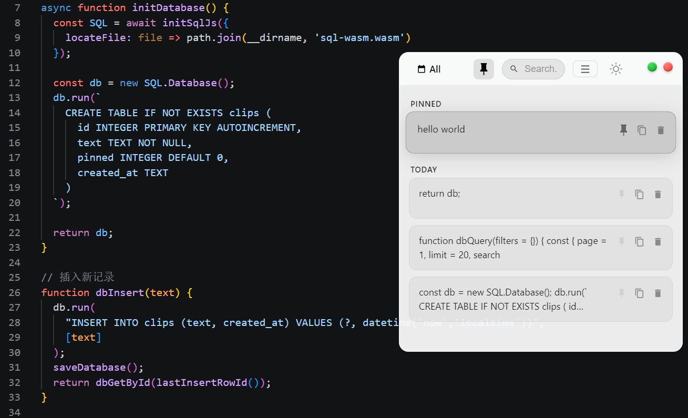
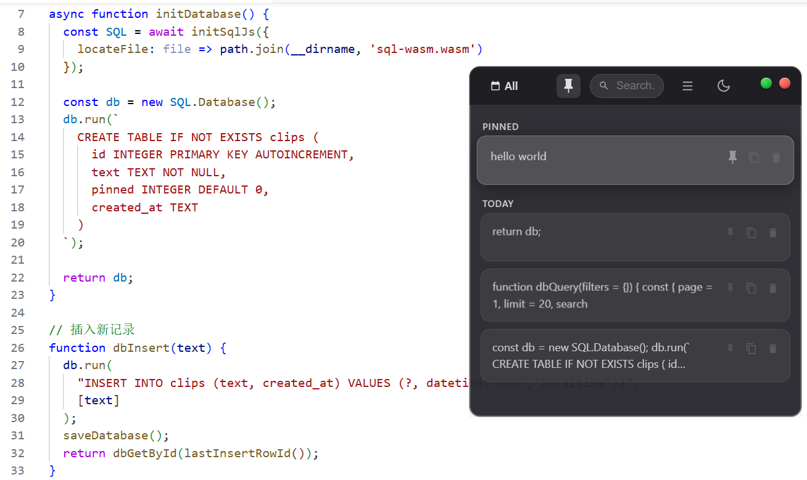

# Clippin - 剪贴板历史记录工具

[English](README_EN.md) | [繁體中文](README_ZH-TW.md) | [日本語](README_JA.md)

## 演示





## 项目概述

Clippin 是一款轻量、现代的 Windows 剪贴板历史管理工具，采用 Glassmorphism 玻璃拟态设计语言，支持快速搜索、置顶、批量操作和全局快捷键唤起。

## 技术栈

- **前端**: HTML + CSS + JavaScript（单文件界面）
- **桌面框架**: Electron
- **数据库**: SQLite（sql.js）

## 功能特性

| 功能 | 说明 |
|------|------|
| 窗口操作 | 可拖拽、可缩放（八向边角调整） |
| 最小化 | macOS 风格飞入 Windows 任务栏动画 |
| 关闭 | 缩放淡出动画 |
| 日期筛选 | 全部 / 今天 / 昨天 / 前天 / 更早前 |
| 搜索 | 实时过滤剪贴板历史 |
| 卡片分组 | 按时间分组显示 |
| 置顶 | 点击图钉图标，卡片置顶并播放 FLIP 动画 |
| 复制 | 点击复制图标或卡片空白处，显示勾号反馈动画 |
| 删除 | 卡片向左滑出并消失 |
| 预览 | 悬停展开长文本内容 |
| 批量操作 | 多选模式下支持批量置顶 / 删除 |

## 设计细节

- 窗口圆角：10px
- 玻璃效果：`backdrop-filter: blur(40px) saturate(180%)`
- 动画曲线：`cubic-bezier(0.25, 0.1, 0.25, 1)`
- 配色：深色渐变背景 + 白色玻璃卡片
- 控制按钮：红色关闭、黄色最小化、绿色置顶（macOS 风格）

## 安装运行

```bash
npm install
npm start
```

## 打包构建

```bash
npm run build:installer  # 安装版
npm run build:portable   # 便携版
npm run build:store      # Microsoft Store / AppX
npm run build            # 全部
```

## 技术亮点

- **FLIP 动画**：列表重排和置顶动画流畅自然
- **Glassmorphism**：使用 backdrop-filter 实现毛玻璃效果
- **多语言支持**：简体中文 / 繁體中文 / 日本語 / English
- **深色模式**：支持跟随系统或手动切换
- **全局快捷键**：`Ctrl + Shift + V` 快速唤起窗口

## 许可证

MIT
