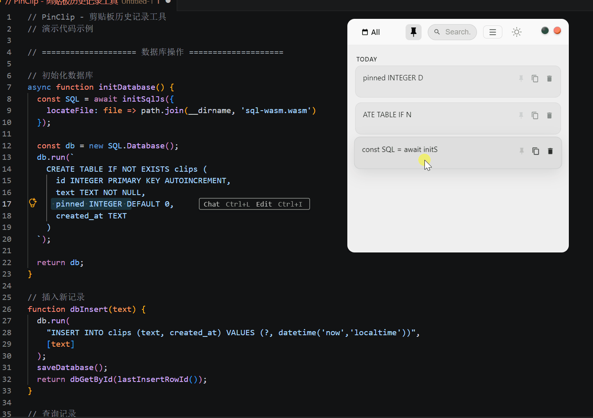
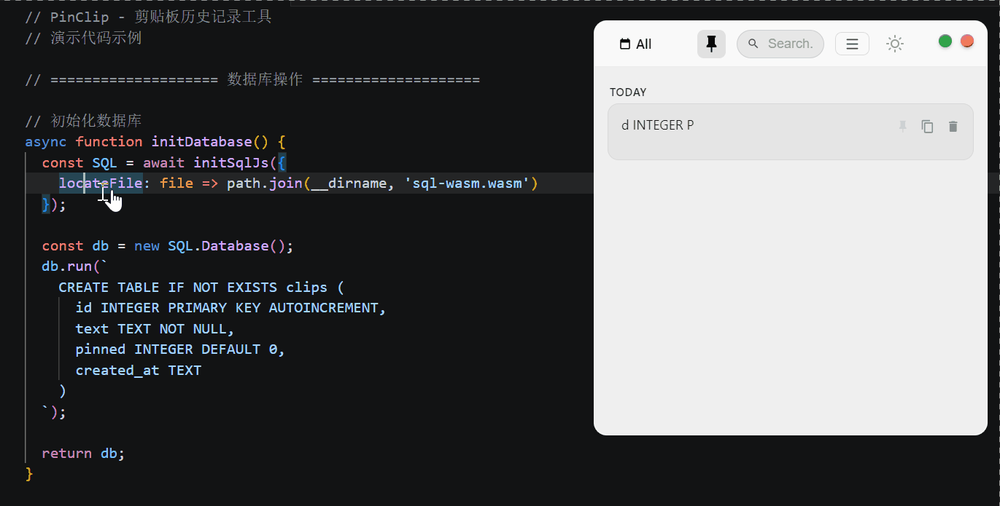
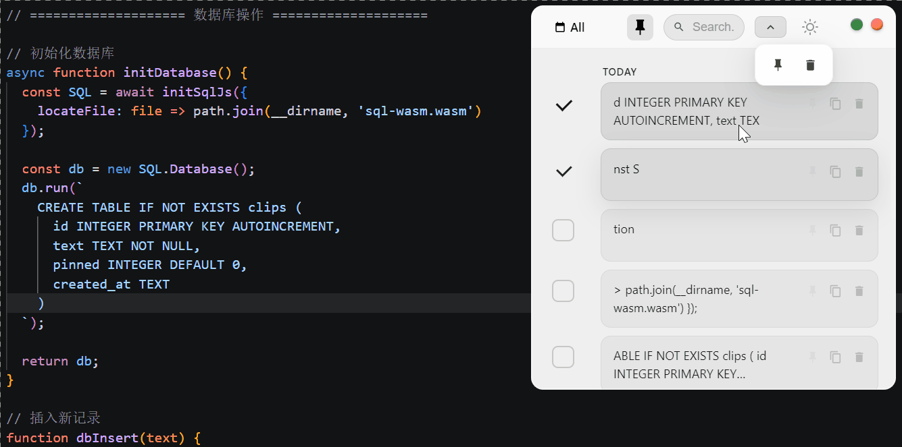

# Clippin - Clipboard History Manager

[Simplified Chinese](README.md) | [Traditional Chinese](README_ZH-TW.md) | [Japanese](README_JA.md)

## Demo

### Clipboard Capture



### History Search



### Batch Operations



## Overview

Clippin is a lightweight, modern clipboard history manager for Windows. It features a glassmorphism interface, fast search, pinning, batch operations, and a global hotkey for quick access.

## Tech Stack

- **Frontend**: HTML + CSS + JavaScript (single-file UI)
- **Desktop Framework**: Electron
- **Database**: SQLite (sql.js)

## Features

| Feature | Description |
|---------|-------------|
| Window Operations | Draggable, resizable (8-direction corners) |
| Minimize | macOS-style fly-in animation to the Windows taskbar |
| Close | Scale fade-out animation |
| Date Filter | All / Today / Yesterday / Day Before / Earlier |
| Search | Real-time filtering |
| Card Grouping | Grouped by time |
| Pin | Pin cards with FLIP animation |
| Copy | Copy by clicking the icon or card body with visual feedback |
| Delete | Card slides left and disappears |
| Preview | Hover to expand long text |
| Batch Operations | Multi-select mode with batch pin / delete |

## Design Details

- Window corner radius: 10px
- Glass effect: `backdrop-filter: blur(40px) saturate(180%)`
- Animation curve: `cubic-bezier(0.25, 0.1, 0.25, 1)`
- Color scheme: Dark gradient background + white glass cards
- Control buttons: Red close, yellow minimize, green pin (macOS style)

## Installation

```bash
npm install
npm start
```

## Build

```bash
npm run build:installer  # Installer
npm run build:portable   # Portable
npm run build:store      # Microsoft Store / AppX
npm run build            # All targets
```

## Highlights

- **FLIP Animations** for smooth list reordering
- **Glassmorphism UI** with frosted glass effects
- **Multi-language Support**: English / ZH-CN / ZH-TW / JA
- **Dark Mode** with system follow or manual switching
- **Global Hotkey**: `Ctrl + Shift + V`

## License

MIT
