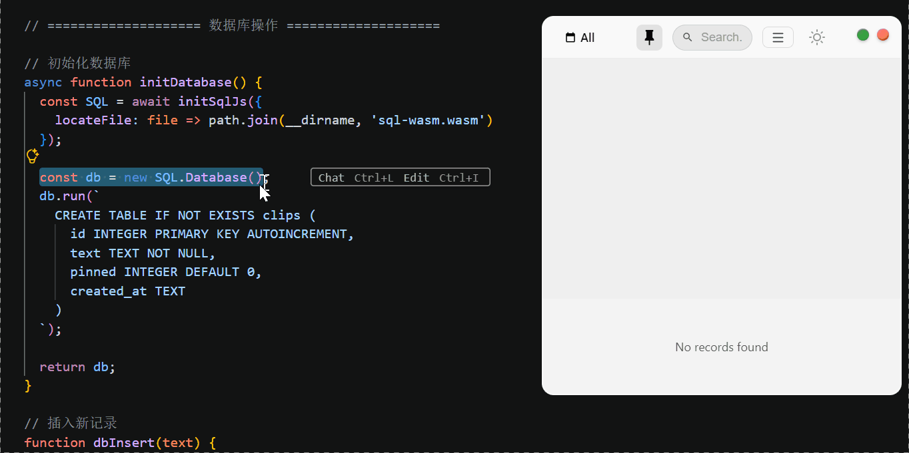
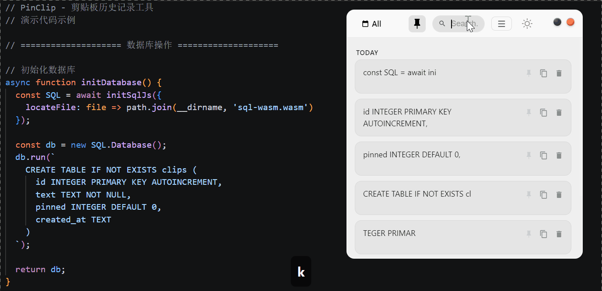

<div align="center">

# PinClip

**一款輕量、精美的 Windows 剪貼簿管理工具，擁有絲滑動畫與 Mica/Acrylic 磨砂玻璃美學。**

由 Vibe Coding 注入靈魂，由人類手工打磨細節。

[简体中文](README.md) · [English](README_EN.md) · [繁體中文](README_ZH-TW.md) · [日本語](README_JA.md)

[](https://github.com/Auiiemily1722/PinClip/releases)
[](LICENSE)

</div>

---

## ✨ 演示

### 📋 剪貼簿捕獲
複製任何內容 — PinClip 瞬間記住。



### 🔍 智能搜尋
毫秒級查找，輸入即過濾。



### ✅ 批量操作
多選置頂、刪除，效率翻倍。


---

## 🎯 為什麼選擇 PinClip？

| 功能 | 說明 |
|------|------|
| 🪟 **Mica / Acrylic 玻璃效果** | 原生 Windows 11 磨砂玻璃美學 |
| ⚡ **即時捕獲** | 自動儲存每一次剪貼簿變化 |
| 🔍 **即時搜尋** | 輸入即過濾 |
| 📌 **置頂功能** | 重要內容始終可見 |
| ✅ **多選操作** | 批量刪除或置頂 |
| 🌙 **深色/淺色模式** | 跟隨系統或手動切換 |
| 🌐 **多語言** | 简体中文、English、繁體中文、日本語 |
| ⌨️ **全域快捷鍵** | `Ctrl+Shift+V` 一鍵喚出 |
| 🎬 **絲滑動畫** | FLIP 動效，流暢縮放與淡入淡出 |

---

## 🛠 技術棧

| 層級 | 技術 |
|------|------|
| 介面 | HTML + CSS + JavaScript（單一檔案） |
| 執行時 | Electron |
| 資料庫 | SQLite via sql.js（WebAssembly） |

---

## 🚀 快速開始

### 下載
從 [Releases](https://github.com/Auiiemily1722/PinClip/releases) 取得最新便攜版 `.exe` — 無需安裝。

### 從原始碼建構
```bash
git clone https://github.com/Auiiemily1722/PinClip.git
cd PinClip
npm install
npm start
```

### 打包
```bash
npm run build:portable   # 便攜版
npm run build:installer # 安裝包
npm run build           # 全部
```

---

## 🎨 設計細節

- **玻璃擬態**：`backdrop-filter: blur(40px) saturate(180%)`
- **動畫曲線**：`cubic-bezier(0.25, 0.1, 0.25, 1)`
- **視窗圓角**：10px
- **macOS 風格控制按鈕**：紅色（關閉）· 黃色（最小化）· 綠色（置頂）

---

## 📄 授權條款

[MIT](LICENSE) © 2026 Auiie

---

<div align="center">

**覺得 PinClip 好用？給個 ⭐ 吧！**

</div>
